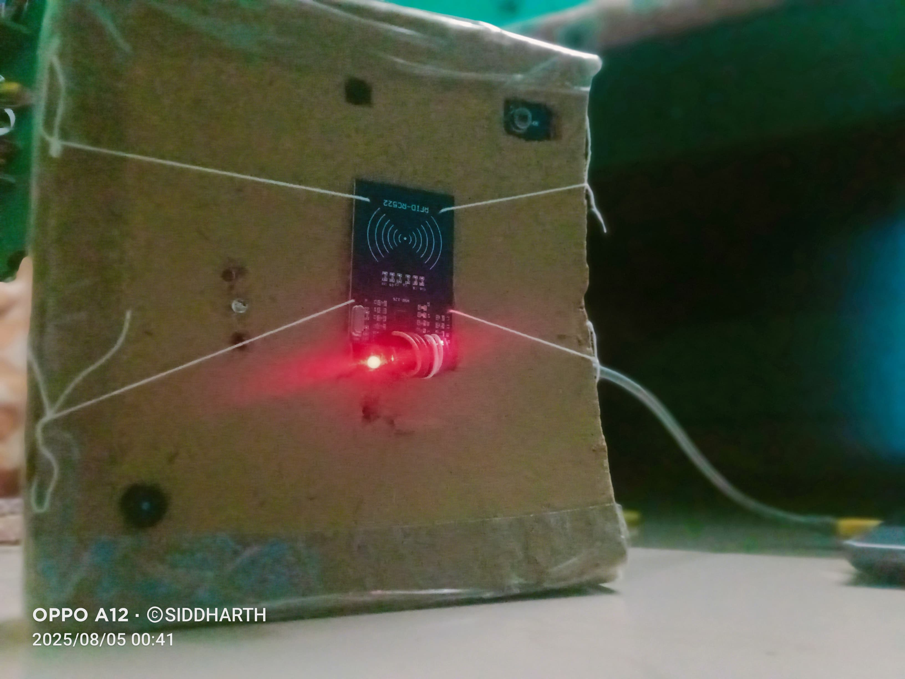
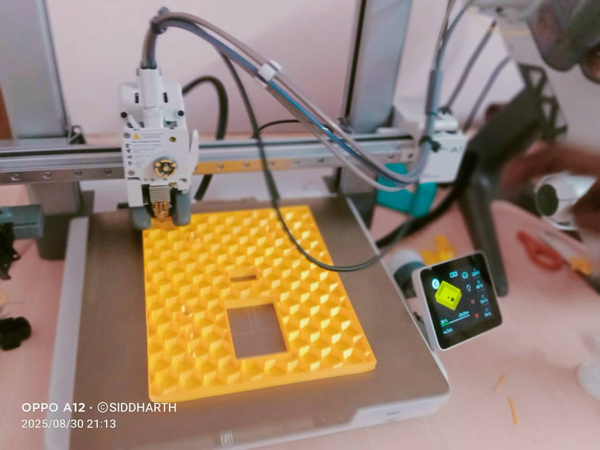
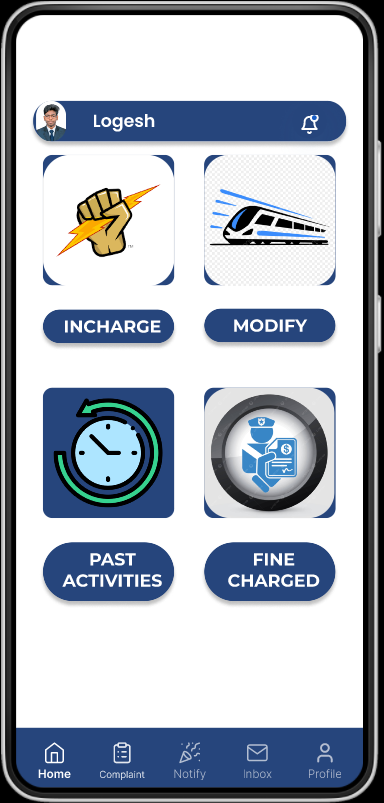
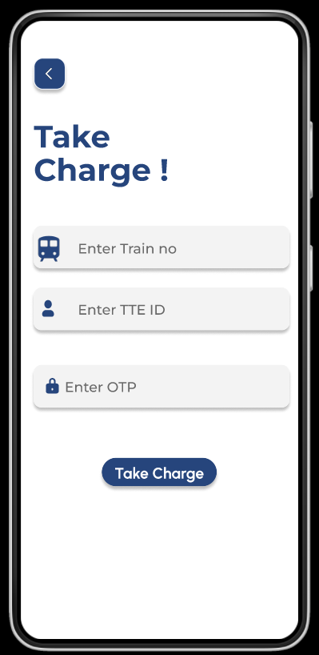
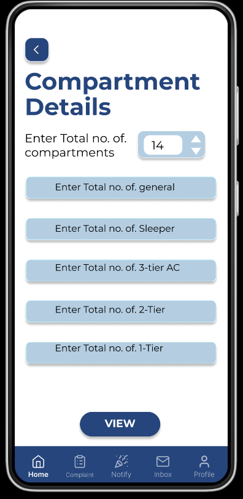
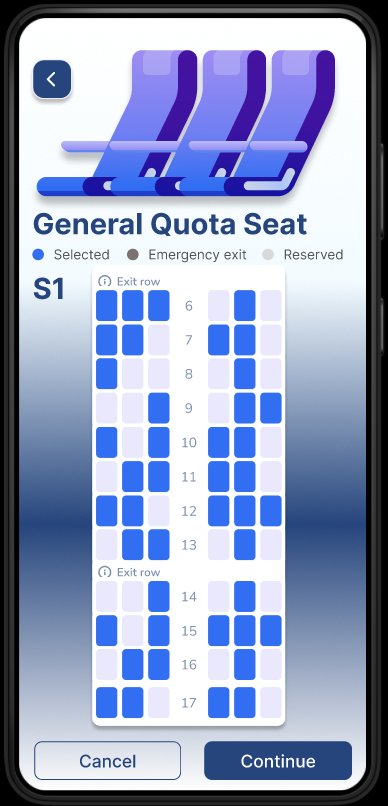
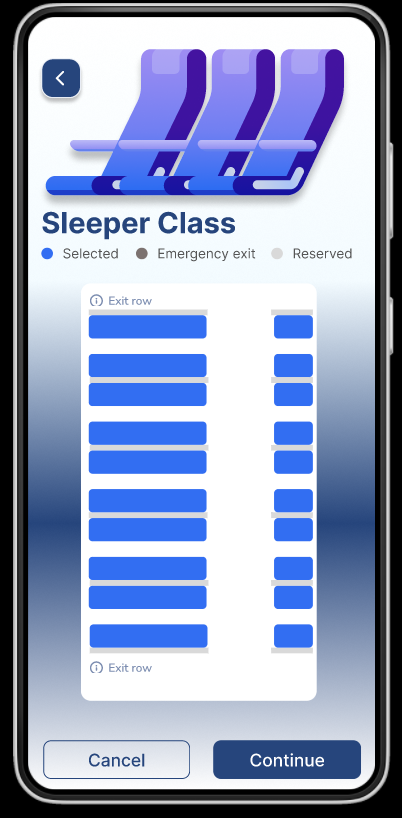
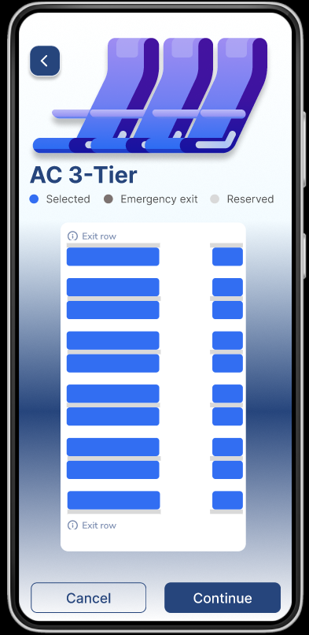
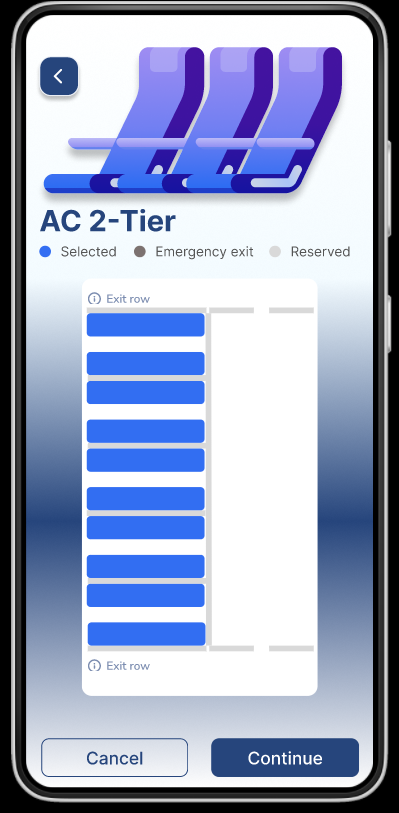
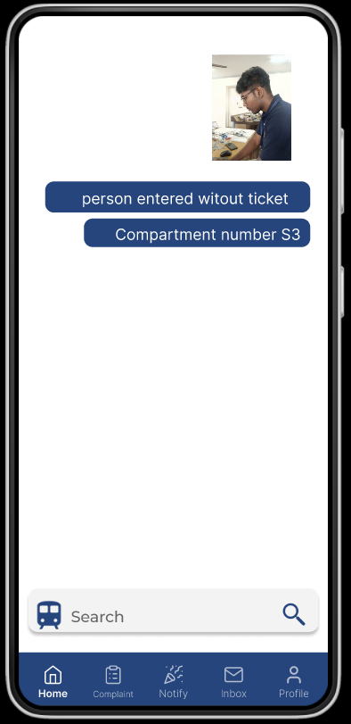

# Smart Train Ticket Verification System (SMTTVS)

---

## Overview

The Smart Train Ticket Verification System (SMTTVS) is an intelligent railway monitoring and ticket verification solution that assists Traveling Ticket Examiners (TTEs) in identifying unauthorized passengers, managing compartments, and improving train security through RFID and IoT technologies.

---

## Technology Stack

| Technology | Purpose |
|------------|----------|
| React.js | Frontend |
| Flask / Node.js | Backend |
| Firebase | Authentication & Database |
| ESP32 | Hardware Controller |
| RFID RC522 | Passenger Verification |
| PIR Sensors | Entry Monitoring |
| ESP32-CAM | Passenger Monitoring |
| Figma | UI Design |
| Vercel | Deployment |

---

## System Architecture

<p align="center">
  
</p>

---

## Hardware Prototype

<table align="center">
<tr>
<td align="center">
<b>3D Printed Prototype</b><br><br>

</td>

<td align="center">
<b>RFID Verification Unit</b><br><br>

</td>
</tr>
</table>

---

## 3D Printing Process

<p align="center">
  
  
</p>

---

## Real-Time Train Installation

<p align="center">
  
</p>

---

## Mobile Application UI

### Splash Screen

<p align="center">
  
</p>

---

### Registration | Login | OTP

<table align="center">
<tr>

<td align="center">
<br>
Registration
</td>

<td align="center">
<br>
Login
</td>

<td align="center">
<br>
OTP Verification
</td>

</tr>
</table>

---

### Dashboard

<p align="center">
  
</p>

---

### Take Charge Module

<p align="center">
  
</p>

---

### Compartment Details

<p align="center">
  
</p>

---

## Seat Management System

<table align="center">

<tr>

<td align="center">
<br>
General
</td>

<td align="center">
<br>
Sleeper
</td>

<td align="center">
<br>
AC 3-Tier
</td>

</tr>

<tr>

<td align="center">
<br>
AC 2-Tier
</td>

<td align="center">
<br>
AC 1-Tier
</td>

<td align="center">
<br>
Chair Car
</td>

</tr>

</table>

---

## Unauthorized Passenger Detection

<p align="center">
  
</p>

---

## Train Modification Module

<p align="center">
  
</p>

---

## System Workflow

```text
RFID Scan
    │
    ▼
Passenger Authentication
    │
    ▼
Entry Detection
    │
    ▼
Compartment Monitoring
    │
    ▼
Unauthorized Entry Detection
    │
    ▼
Alert Generation
    │
    ▼
TTE Verification
    │
    ▼
Fine Processing
```

---

## Key Features

- RFID Based Passenger Verification
- Unauthorized Passenger Detection
- Real-Time TTE Alerts
- Smart Seat Management
- OTP Based Authentication
- Firebase Integration
- Train Modification Module
- Fine Charging System
- Mobile Friendly Interface
- IoT Enabled Monitoring

---

## Developer

**Siddharth B**

Aspiring Software Engineer  
IoT Developer  
Full Stack Developer

---

## License

This project is developed for educational, research, and innovation purposes.
